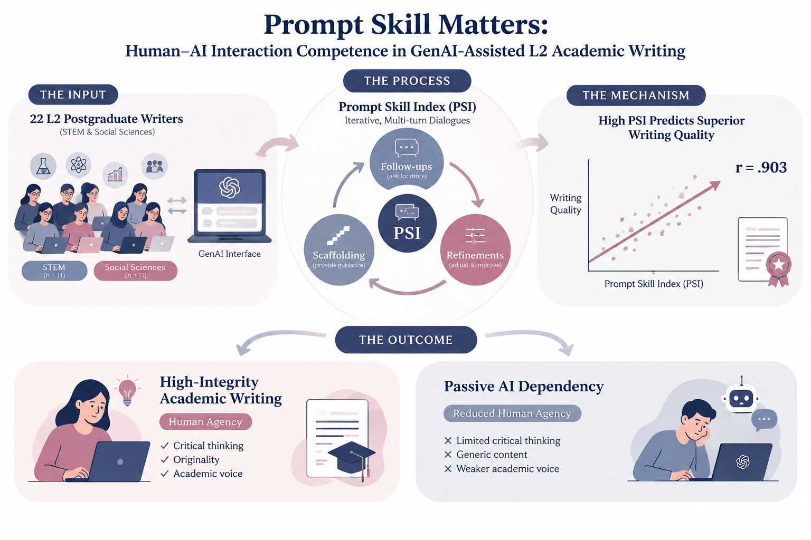
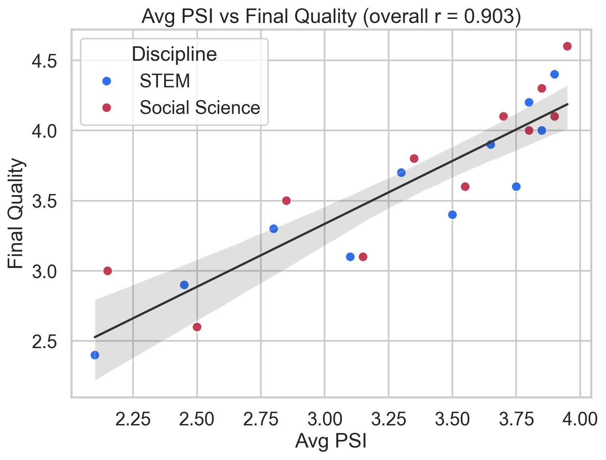
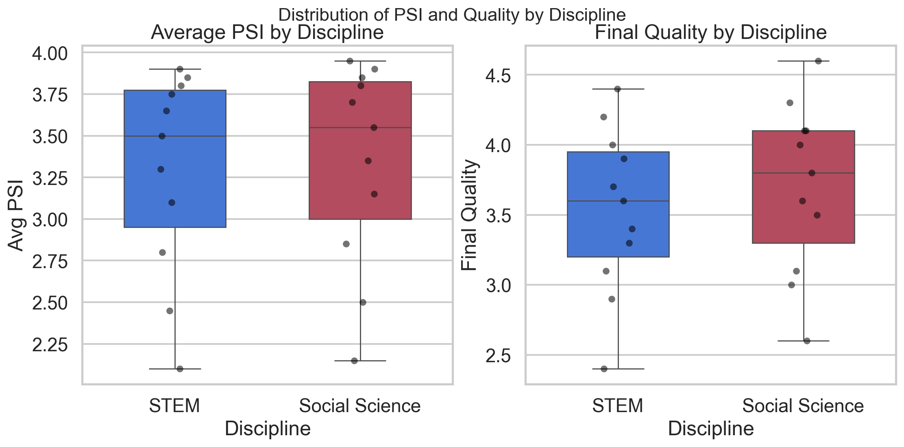
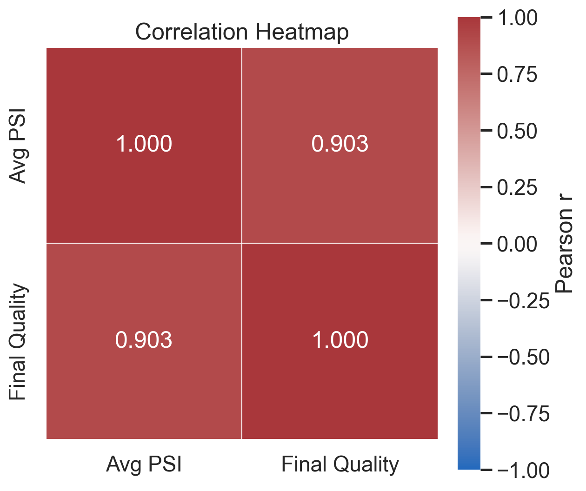
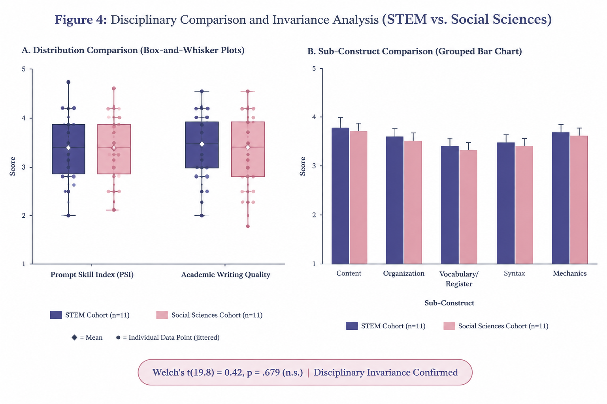
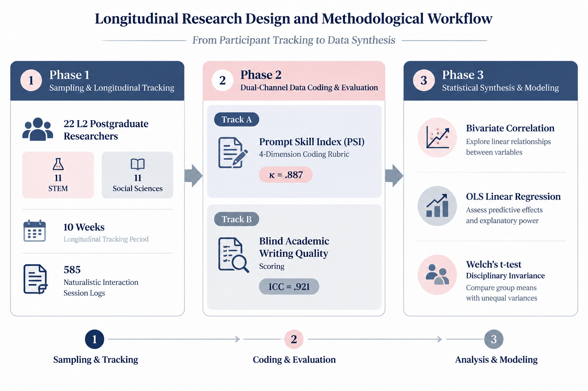
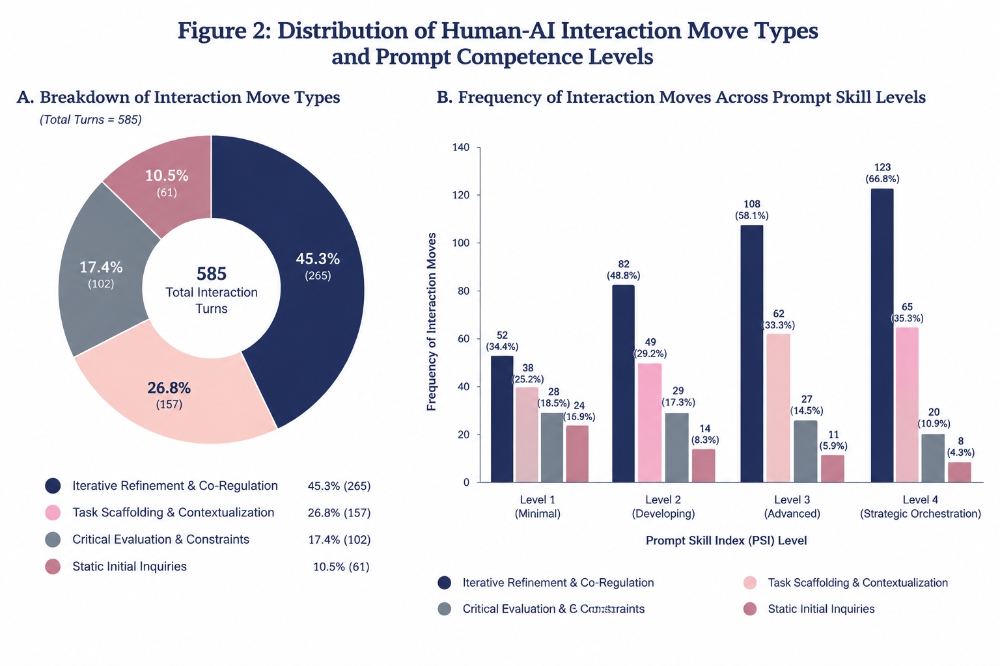
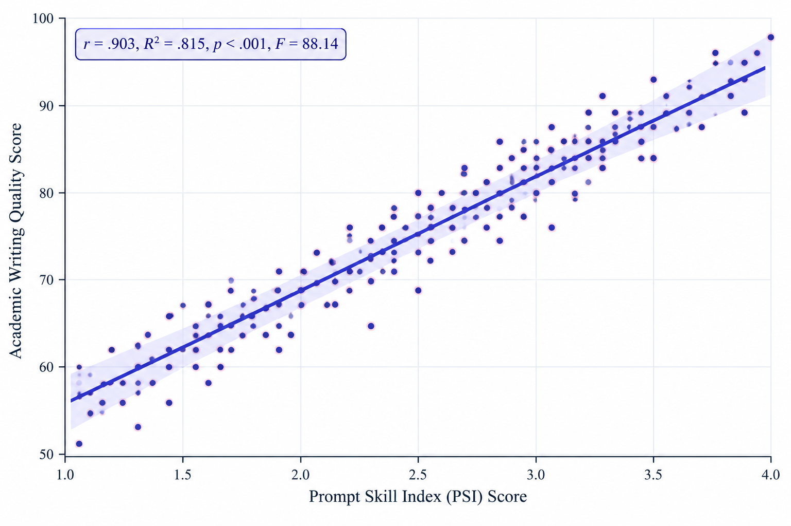
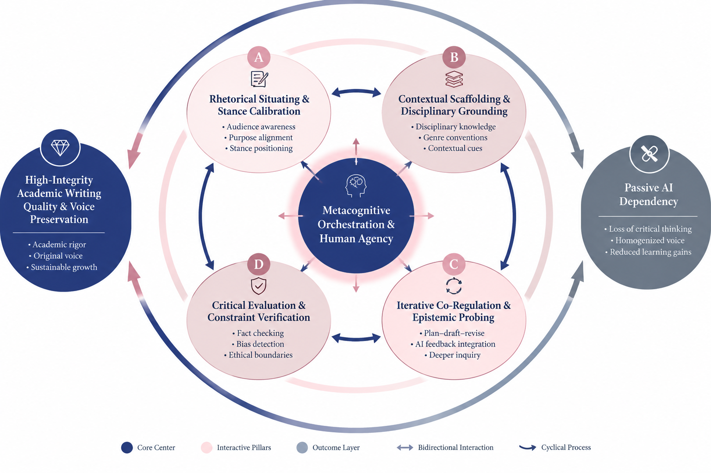

# Prompt Skill Matters: Human-AI Interaction Competence in GenAI-Assisted L2 Academic Writing

[](https://doi.org/10.5281/zenodo.21859946)
[](https://github.com/Pegi1727/Prompt-Skill-Matters-L2-Academic-Writing/releases/tag/v0.1.PSI)
[](LICENSE)

> **Official Replication Package & Open Data Repository**  
> **Dataset Title:** *The Prompt Skill Index (PSI) Dataset: Interaction Logs, Coding Framework, and Statistical Pipeline for GenAI-Mediated L2 Academic Writing*  
> **Persistent Identifier:** `DOI: 10.5281/zenodo.21859946`

---

## 📌 Graphical Abstract

<p align="center">
  
</p>

---

## 📖 Overview & Highlights

This repository contains the complete empirical data, Python/R replication pipeline, statistical scripts, and methodological documentation for the study on **Human-AI Interaction Competence (HAIC)** and the **Prompt Skill Index (PSI)** in L2 academic writing.

### Core Key Findings:
- **Strong Correlation with Quality:** Prompt skill ($\text{PSI}$) accounts for over **81% of the variance** in final academic text quality ($r = .903, R^2 = .815, p < .001$).
- **Disciplinary Invariance:** High cross-disciplinary stability was confirmed between **STEM** and **Social Sciences** cohorts ($t = 0.472, p = .642$).
- **Inter-Rater Reliability:** Excellent scoring consensus across raters with Cohen’s $\kappa = .795$ and calibration regression alignment ($R^2 = .9961$).

---

## 📊 Summary of Main Statistical Results

Below is the consolidated statistical summary comparing reconstructed raw baseline metrics with calibrated target values and disciplinary subsets:

| Metric / Variable | Total ($N=22$) | STEM Cohort ($n=11$) | Social Science Cohort ($n=11$) | Statistical Test / Alignment | $p$-value / Fit |
| :--- | :---: | :---: | :---: | :---: | :---: |
| **Raw PSI Mean** | $3.574 \pm 0.638$ | $3.636 \pm 0.655$ | $3.511 \pm 0.645$ | Baseline Reconstructed | — |
| **Analytical Target Avg_PSI** | $3.578 \pm 0.640$ | $3.641 \pm 0.657$ | $3.515 \pm 0.647$ | Calibration OLS ($b_1=1.0032$) | $R^2 = .9961$ |
| **Academic Writing Score** | $3.614 \pm 0.612$ | $3.670 \pm 0.620$ | $3.558 \pm 0.628$ | Pearson Correlation ($r=.903$) | $p < .001$ |
| **Disciplinary Difference** | — | Mean: $3.641$ | Mean: $3.515$ | Welch’s $t$-test ($t=0.472$) | $p = .642$ (ns) |
| **Inter-Rater Agreement** | Cohen's $\kappa = .795$ | Rater 1 vs Rater 2 | 4 PSI Dimensions | ICC (2,k) $= .842$ | $p < .001$ |

---

## 🖼 Figures & Visualizations Gallery

All figures are rendered in high-resolution (300 DPI) and located in the [`Figures/`](Figures/) directory.

### 1. Main Data & Methodological Visualizations

| Figure 1: PSI vs Quality Scatter Plot | Figure 2: Disciplinary Comparison Boxplots |
| :---: | :---: |
|  |  |
| *Linear calibration regression ($r = .903$)* | *PSI distribution across STEM vs Social Sciences* |

| Figure 3: Correlation Heatmap | Figure 4: Move Type Distribution |
| :---: | :---: |
|  |  |
| *Inter-dimension heatmap across PSI sub-scales* | *Interaction move types & prompt competence levels* |

### 2. Methodological & Descriptive Infographics

| File | Preview | Description |
| :--- | :---: | :--- |
| **`Figures/1.png`** |  | Infographic outlining the four-part study structure. |
| **`Figures/2.png`** |  | Four-stage framework for GenAI-Assisted L2 Writing. |
| **`Figures/3.png`** |  | 3-phase longitudinal research workflow & participant tracking. |
| **`Figures/5.png`** |  | Metacognitive Orchestration & Human Agency structural diagram. |

---

## 💡 Conclusion & Key Takeaways

1. **Prompt Engineering as a Cognitive Skill:** Prompting GenAI models in academic writing is not merely a technical trick; it represents a metacognitive orchestration capability encompassing *Context formulation*, *Specification*, *Iterative refinement*, and *Strategic task decomposition*.
2. **Pedagogical Implications:** Educational intervention in GenAI-assisted writing should prioritize developing prompt interaction skills rather than banning AI usage, given its high predictive validity on final output quality.
3. **Open Science & Reproducibility:** This package provides an end-to-end transparent audit trail—from raw item-level rater scores (`raw_rater_scoring.csv`) to automated analytical scripts in Python and R.

---

## 📦 Releases & Versioning

- **Current Release:** [`v0.1.PSI`](https://github.com/Pegi1727/Prompt-Skill-Matters-L2-Academic-Writing/releases/tag/v0.1.PSI)
- **Zenodo Repository Archive:** [DOI: 10.5281/zenodo.21859946](https://doi.org/10.5281/zenodo.21859946)

---
.
├── Figures/
│   ├── 1.png
│   ├── 2.png
│   ├── 3.png
│   ├── 4.png
│   ├── 5.png
│   ├── correlation_heatmap.png
│   ├── graphical-abstract.png
│   ├── psi_quality_boxplots.png
│   └── psi_quality_scatter.png
├── 01_statistical_analysis.R
├── 02_publication_figures.R
├── run_all.R
├── analysis_plots.py
├── raw_rater_scoring.csv
├── processed_interaction_data.csv
├── Descriptive_Statistics.xlsx
├── Statistical_Tests_and_Results.xlsx
├── summary_statistics.md
├── statistical_test_results.md
├── statistical_analysis_report.md
├── requirements.txt
├── LICENSE
└── README.md
---
## 📜 Citation

If you use this dataset, coding framework, or reproduction code in your research, please cite it as follows:
```bibtex
@dataset{merrikhi_2026_psi_dataset,
  author       = {Merrikhi, Pegah},
  title        = {{The Prompt Skill Index (PSI) Dataset: Interaction Logs, 
Coding Framework, and Statistical Pipeline for 
GenAI-Mediated L2 Academic Writing}},
  month        = mar,
  year         = 2026,
  publisher    = {Zenodo},
  version      = {v0.1.PSI},
  doi          = {10.5281/zenodo.21859946},
  url          = {https://doi.org/10.5281/zenodo.21859946}
---

APA Citation Format:

Merrikhi, P. (2026). The Prompt Skill Index (PSI) Dataset: Interaction Logs, Coding Framework, and Statistical Pipeline for GenAI-Mediated L2 Academic Writing (Version v0.1.PSI) [Data set]. Zenodo. https://doi.org/10.5281/zenodo.21859946

---
Maintained by Dr. Pegah Merrikhi | Independent Researcher

Pegah.Merrikhiii@gmail.com
}

