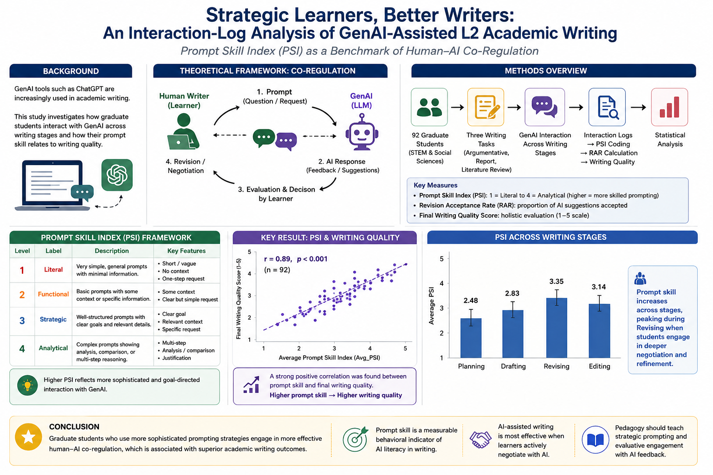

# Prompt Skill Matters: Examining GenAI Interaction and Writing Quality in L2 Academic Writing

[](https://opensource.org/licenses/MIT)
[](https://www.python.org/downloads/)
[](#)

Welcome to the official replication and open science repository for the study:  
**"Prompt Skill Matters: Examining GenAI Interaction and Writing Quality in L2 Academic Writing"**

Author: **Pegah Merrikhi** *(Independent Researcher, PhD in TESOL/Applied Linguistics)*

---

## 🎨 Graphical Abstract



*Figure GA: Conceptual summary of GenAI-mediated co-regulation, Prompt Skill Index (PSI) trajectories, and L2 academic writing quality outcomes.*

---

## 📌 Abstract & Overview

Generative AI (GenAI) integration into L2 academic writing requires a nuanced understanding of how human-AI interaction strategies influence text quality. This project introduces the **Prompt Skill Index (PSI)** and evaluates interaction trajectories across disciplines (Hard vs. Soft Sciences) and writing stages (Pre-writing, Drafting, Revision).

Using linear mixed-effects models (LMM) and computational linguistic metrics (LSA, MTLD, RAR, PSI), this study demonstrates that higher prompt literacy significantly predicts macro-structural cohesion, lexical diversity, and overall academic writing quality.

---

## 📊 Publication Figures Gallery

All high-resolution figures prepared for journal submission and peer review are available in the [`Figures/`](Figures/) directory:

| ID | Title & Focus | Key Findings / Visual Content | File Link |
| :---: | :--- | :--- | :---: |
| **GA** | **Graphical Abstract** | Comprehensive visual summary of the research methodology and findings. | [View Figure](Figures/ga.png) |
| **Fig 1** | **Distribution of Writing Stages** | Frequency and duration of GenAI interaction across Pre-writing, Drafting, and Revision. | [View Figure](Figures/Figure_1_Distribution_Writing_Stages.png) |
| **Fig 2** | **PSI Score Distribution** | Kernel density estimation and distribution of Prompt Skill Index (PSI) scores. | [View Figure](Figures/Figure_2_PSI_Distribution.png) |
| **Fig 3** | **Disciplinary Comparison** | Comparative analysis of interaction depth between Hard and Soft Science domains. | [View Figure](Figures/Figure_3_Disciplinary_Comparison.png) |
| **Fig 4** | **PSI-Quality Correlation** | Scatter plot with trend lines showing the strong positive correlation between PSI and Writing Quality. | [View Figure](Figures/Figure_4_PSI_Quality_Correlation.png) |
| **Fig 5** | **Regression Coefficients** | Forest plot of standardized LMM coefficients for PSI, prompt depth, and co-regulation metrics. | [View Figure](Figures/Figure_5_Regression_Coefficients.png) |
| **Fig 6** | **Conceptual Framework** | Theoretical model integrating ADFF / HACF frameworks in AI-assisted L2 academic literacy. | [View Figure](Figures/Figure_6_Conceptual_Framework.png) |

> 📁 *A complete high-resolution contact sheet containing all figures is available here: [Figures_1_to_6_contact_sheet.png](Figures/Figures_1_to_6_contact_sheet.png)*

---

## 📂 Statistical Submission Pack & Reproducibility

This repository adheres to the highest standards of **Open Science and Reproducibility**. All raw datasets, feature-engineered scoring files, and execution pipelines are open-access.

### Included Data & Scripts
```text
.
├── Figures/                                   # All publication-ready figure assets
│   ├── ga.png
│   ├── Figure_1_Distribution_Writing_Stages.png
│   ├── Figure_2_PSI_Distribution.png
│   ├── Figure_3_Disciplinary_Comparison.png
│   ├── Figure_4_PSI_Quality_Correlation.png
│   ├── Figure_5_Regression_Coefficients.png
│   ├── Figure_6_Conceptual_Framework.png
│   └── Figures_1_to_6_contact_sheet.png
├── Statistical_Submission_Pack/              # Reproducibility bundle for reviewers
│   ├── participant_level_data.csv             # Participant-level PSI scores & performance indicators
│   ├── reproducible_analysis.py               # Complete Python pipeline for statistical modeling & plotting
│   └── statistical_appendix_report.md         # Full technical appendix & supplementary tables
├── AI_Co_Regulation_Interactions.csv          # Raw interaction event logs
├── AI_Co_Regulation_Interactions_with_scores.csv # Processed interaction dataset with PSI metrics
└── Statistical_Submission_Pack.zip            # Downloadable zipped submission pack
